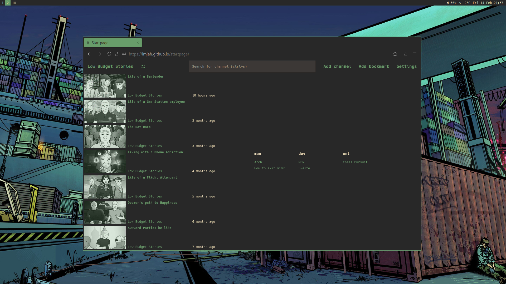

<div align="center">

# Startpage




</div>

A [startpage](https://reddit.com/r/startpages/) with lightweight and
privacy-friendly YouTube feed designed for flat gruvbox themed window managers.

**The project is currently in development. You can experience missing features.**

# Features

- YouTube data from [Piped API](https://github.com/TeamPiped/Piped)
- Support for channels and playlists
- No need to install self-hosted proxy services

# Roadmap

- [x] Youtube channel support
- [x] Youtube playlist support
- [x] Feed
- [x] Feed filter
- [x] Feed editor
- [x] Feed add item
- [ ] Feed lazyloading
- [ ] Bookmarks
- [ ] Bookmarks editor
- [x] Bookmarks add item
- [x] Settings
- [x] Settings editor
- [ ] Settings import/export
- [x] Fetch cache
- [ ] Fetch indicator
- [ ] Offline mode
- [ ] Keyboard shortcuts
- [ ] Encrypted server synchronization

# Development

#### Setup

```sh
npm install
```

#### Build and hot reload

```sh
npm dev
```
